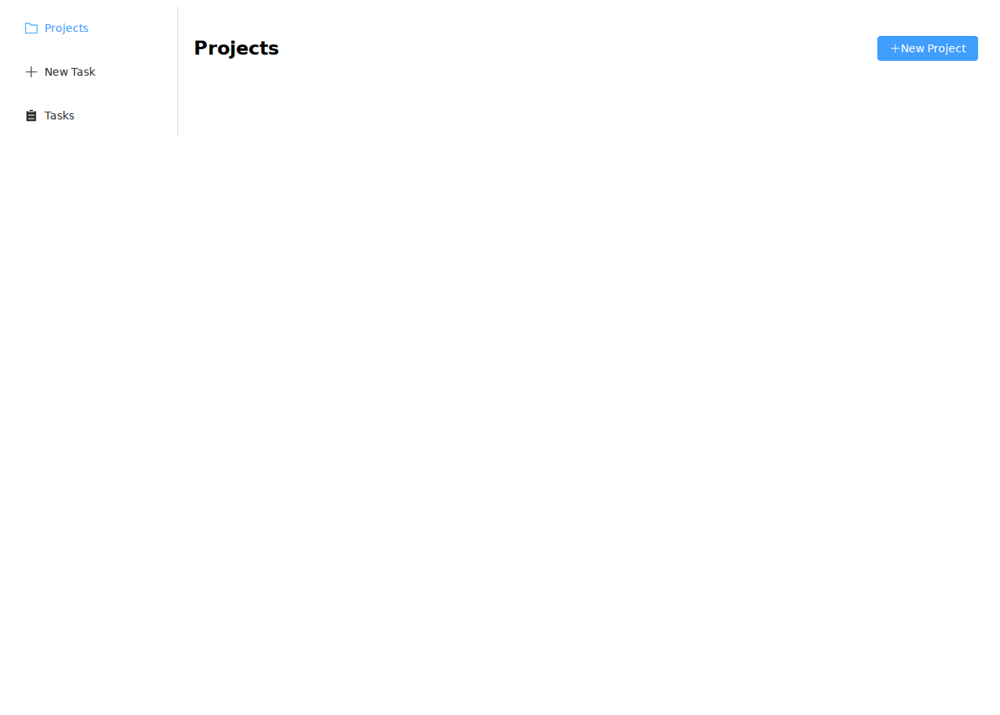
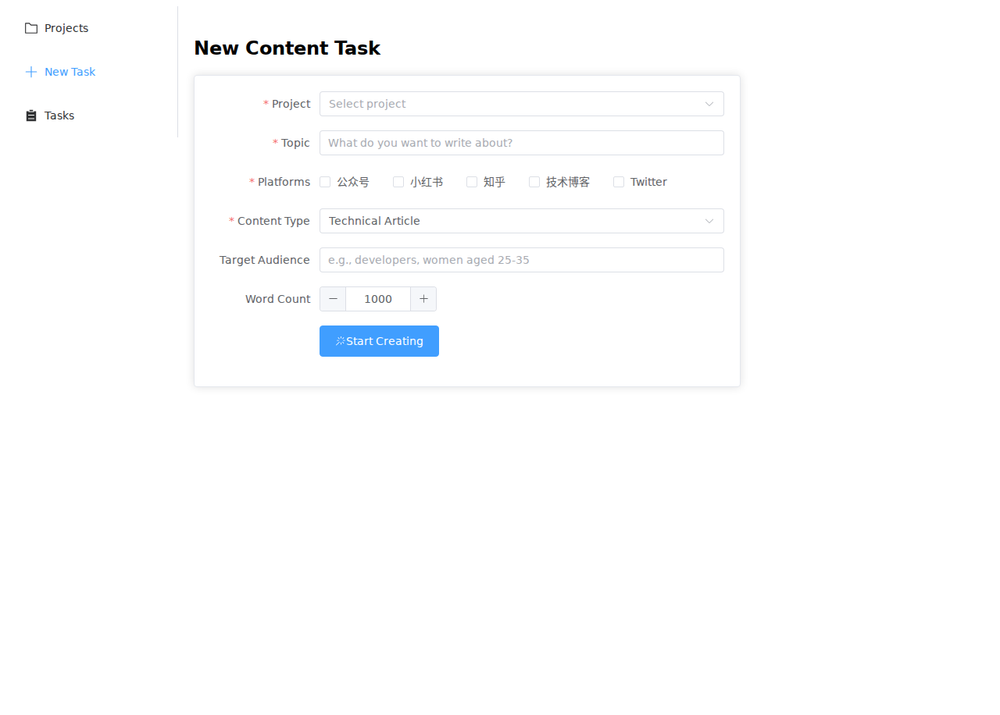
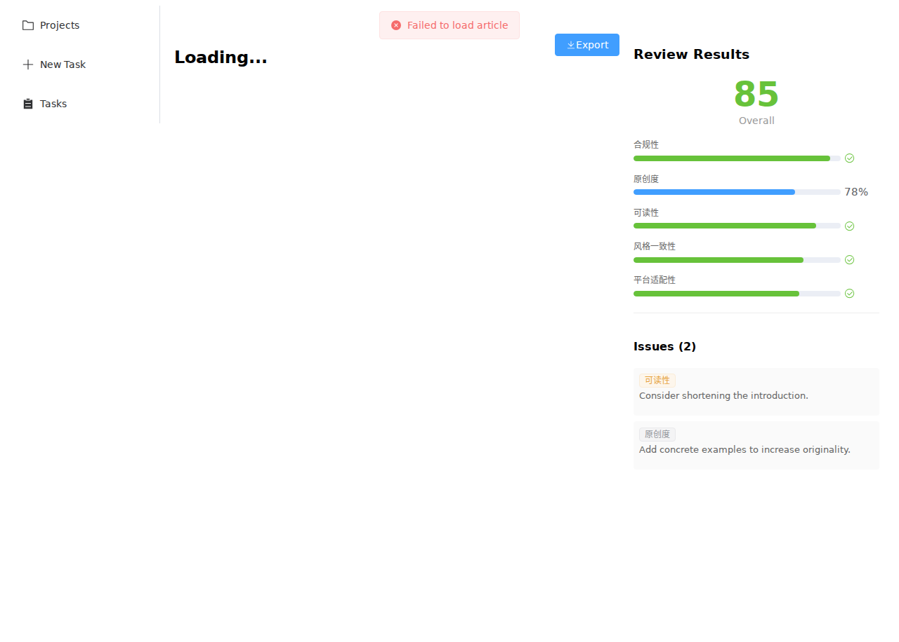

# ContentForge 🔧

> 通用多 Agent 内容创作引擎 — RAG 驱动 · LangGraph 编排 · FastAPI + Vue3

ContentForge 是一个基于 AI Agent 的内容创作平台。上传知识文档 → Agent 学习风格 → 自动化内容生成。适用于技术博客、品牌营销、学术写作等多种场景。

## 🖼️ 界面预览

| 项目管理 | 新建任务 | 文章编辑器 + 审核 |
|:---:|:---:|:---:|
|  |  |  |

## ✨ 核心特性

- **4-Agent 流水线** — 选题策划 → 内容写作 → 质量审核 → 格式导出，LangGraph 条件编排
- **RAG 知识库** — 上传 .md/.txt 文档，Agent 以你的风格生成内容
- **多平台适配** — 一次性生成适配公众号、小红书、知乎、技术博客等内容
- **实时进度推送** — SSE 实时查看 Agent 工作进度
- **质量审核** — 5 维度评分（合规性、原创度、可读性、风格一致性、平台适配性）
- **多种导出格式** — Markdown / Plain Text / Rich Text (HTML) / PDF
- **可观测性** — OpenTelemetry 追踪 Agent 调用链
- **MCP 协议** — 标准化工具接口，可接入任何 MCP 客户端

## 🏗️ 技术栈

| 层级 | 技术 |
|------|------|
| 前端 | Vue 3 + TypeScript + Element Plus + Pinia |
| 后端 | FastAPI + Pydantic v2 |
| Agent 编排 | LangGraph (StateGraph) |
| 向量存储 | ChromaDB |
| 元数据库 | SQLite |
| 协议 | MCP (Model Context Protocol) |
| 可观测性 | OpenTelemetry |
| 部署 | Docker Compose |

## 🚀 快速启动

### 本地开发

```bash
# 1. 启动后端
cd backend
uv venv
.venv/bin/pip install -e .
.venv/bin/uvicorn app.api.main:app --reload

# 2. 启动前端
cd frontend
npm install
npm run dev
```

### Docker 部署

```bash
docker compose up --build
```

访问 http://localhost:5173 即可使用。

## 📁 项目结构

```
contentforge/
├── backend/
│   ├── app/
│   │   ├── agents/         # 4 个 Agent（Planner / Writer / Reviewer / Exporter）
│   │   ├── api/            # REST API 路由（projects / knowledge / tasks / articles / export）
│   │   ├── graph/          # LangGraph StateGraph 工作流编排
│   │   ├── models/         # Pydantic 数据模型
│   │   ├── db/             # SQLite CRUD 数据层
│   │   ├── rag/            # ChromaDB 向量存储 + 知识库索引器
│   │   ├── mcp/            # MCP 协议 Server（6 个工具）
│   │   ├── services/       # Git 同步服务
│   │   ├── observability/  # OpenTelemetry 追踪
│   │   └── middleware.py   # 安全中间件（请求体限制 + 可选 Token 认证）
│   └── tests/              # 78 个测试用例
├── frontend/
│   ├── src/
│   │   ├── views/          # 7 个页面（项目管理 / 知识库 / 任务创建 / 进度追踪 / 文章编辑器 / 任务 Trace / 导出门）
│   │   ├── components/     # 可复用组件
│   │   ├── stores/         # Pinia 状态管理
│   │   └── services/       # Axios API 调用层
│   └── ...
└── docker-compose.yml
```

## 🔒 安全说明

本项目为开发阶段，默认无鉴权。部署到公网前建议：

- 配置 `API_TOKEN` 环境变量启用 Bearer Token 认证
- 使用 nginx 反向代理添加 HTTPS 和速率限制
- 安装 CORS `allow_origins` 为具体域名

## 📝 开发计划

- [ ] 真实 LLM 集成（支持 OpenAI / Claude / 国产模型）
- [ ] SSE 实时进度推送
- [ ] Web 搜索集成
- [ ] 项目 CRUD 完善

## 📄 许可证

Unlicense — 公共领域，无使用限制。
